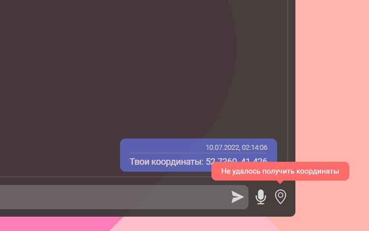

## Дипломная работа по курсу "Продвинутый JavaScript"

Здесь представлен бот, который предназначен как для хранения информации в виде текстовых сообщений, изображений, аудио и видео файлов. Также бот имеет интеграцию с несколькими сервисами API. Он может получать погоду используя Ваше местоположение, новости, курсы таких валют как доллар(USD), евро(EUR), Bitcoin(BTC).

- Подключение к серверу происходит автоматически. При успешном подключении показывается зеленый индикатор и кнопка 'Connect' не активна. Если произойдет отключение цвет индикатора изменится на красный и кнопка станет активной. Можно пробовать подключиться нажатием на кнопку. (Возможно Вам повезет)
- При подключении нескольких ботов сообщения будут видны всем участникам. Сообщения команд, геолокация и ответы на эти команды видны только отправившему их участнику. Также они не сохраняются в истории.
- Бот сохраняет сообщения на сервере. Если в тексе имеются ссылки они дополнительно выделяются. Отправка сообщения возможна по клавише 'Enter' или при клике на иконку отправить. При подключении к серверу происходит загрузка последних 10 сообщений из истории. 
- По мере просмотра ленты сообщений они автоматически подгружаются с сервера.
- Для загрузки доступны файлы изображений, аудио и видео. Загрузить файлы можно по кнопке загрузить(скрепка) или перетащив файл в область сообщений. 
  Загрузка через DnD:  Изображения:  Аудио файлы:  Видео файлы:  Если загрузка файла не поддерживается появится сообщение об ошибке: 
 - Чтобы скачать файл необходимо выбрать сохранить.Если это изображение то достаточно кликнуть по нему и откроется окно выбора места сохранения.
  

## Геолокация

Чтобы посмотреть свои gps координаты (геолокацию) необходимо разрешить доступ к местоположению на устройстве и нажать кнопку получения координат.  
Если что-то пойдет не так или нет доступа к местоположению, будет сообщение об ошибке. 

## Запись аудио

Для записи аудио сообщения необходимо разрешить доступ к аудио на устройстве. Для начала записи необходимо нажать кнопку записи (иконка микрофон). При отсутствии доступа появится сообщение об ошибке.

Если все хорошо начнется запись и появится панель с кнопкой стоп и временем записи: 
По окончанию запись будет добавлена в окно сообщений: 

## Команды
Как было сказано ранее бот поддерживает несколько команд. Все они получают данные используя API различных сервисов.
- Все команды начинаются с '/get'.
- При пустом поле сообщения достаточно нажать клавишу стрелку вправо и '/get' будет добавлено с поле автоматически. Вам останется только дописать команду.

Команды:
- /get погода - погода
- /get news - новости
- /get crypto - курс Биткоин к доллару
- /get usd - курс доллара
- /get eur - курс евро

### Погода
Чтобы получить погоду необходимо отправить боту команду '/get погода'. Для определения погоды используются ваше местоположение. Оно должно быть доступно иначе будет ошибка. Погоду и API нам предоставляет сервис https://www.weatherapi.com 

### Новости
Чтобы получить новость необходимо отправить боту команду '/get news'. По ссылке 'Подробнее...' можно прочитать полную новость на сайте. Новости и API нам предоставляет https://newsdata.io 

### Курсы Bitcoin
Чтобы получить актуальный курс BTC необходимо отправить боту команду '/get crypto'. Курс и API нам предоставляет https://www.blockchain.com

### Курсы USD и EUR
Чтобы получить актуальные курсы доллара(USD) и евро(EUR) необходимо отправить боту команду '/get usd' или '/get eur'. 
На этом всё)))
